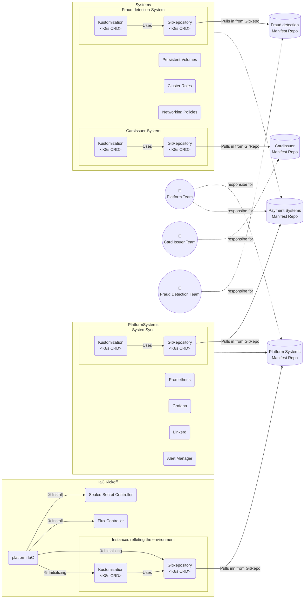

# GitOps Systems Architecture

This is the GitOps architecture I created at If-insurance, a rather large insurance company in the Nordics. It is based on the [GitOps principles](https://www.weave.works/technologies/gitops/) and the [GitOps FAQ](https://www.weave.works/blog/gitops-faq). Please read the blog post and explanation of the setup on [my blog](https://fredrkl.com/blog/infrastructure-as-code-vs-gitops-a-real-world-example/).

The diagram is created with [mermaid.js](https://mermaid.js.org/).

We use [kustomize](https://kustomize.io/) extensively. Please read on how we use it together with branches to control rolling out changes to different environments [here](./kustomize.md). The Kustomization CRD boxes are the configuration of how the Git changes are applied. Please see [Kustomization CRD](https://fluxcd.io/flux/components/kustomize/kustomization/) for more information and examples.
